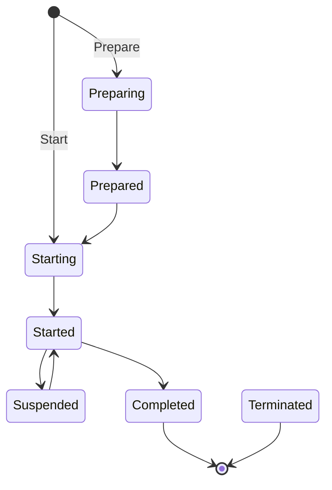
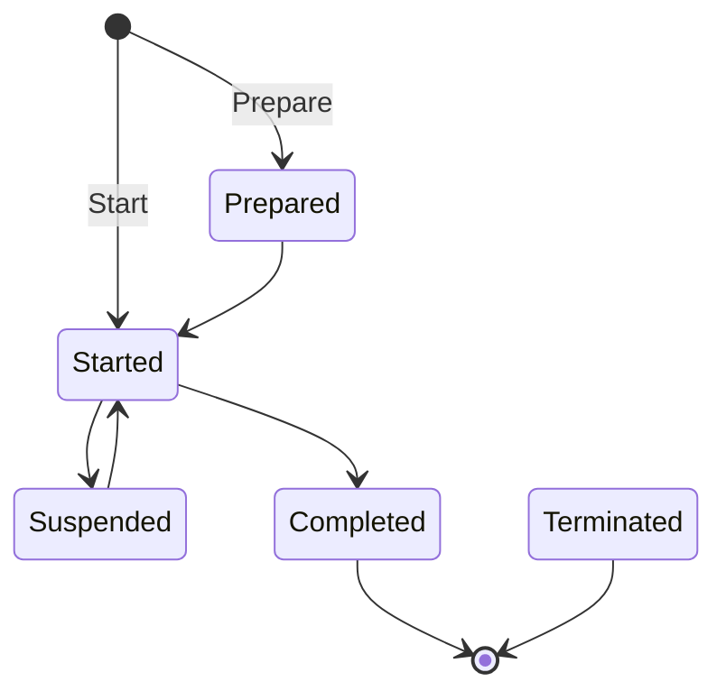
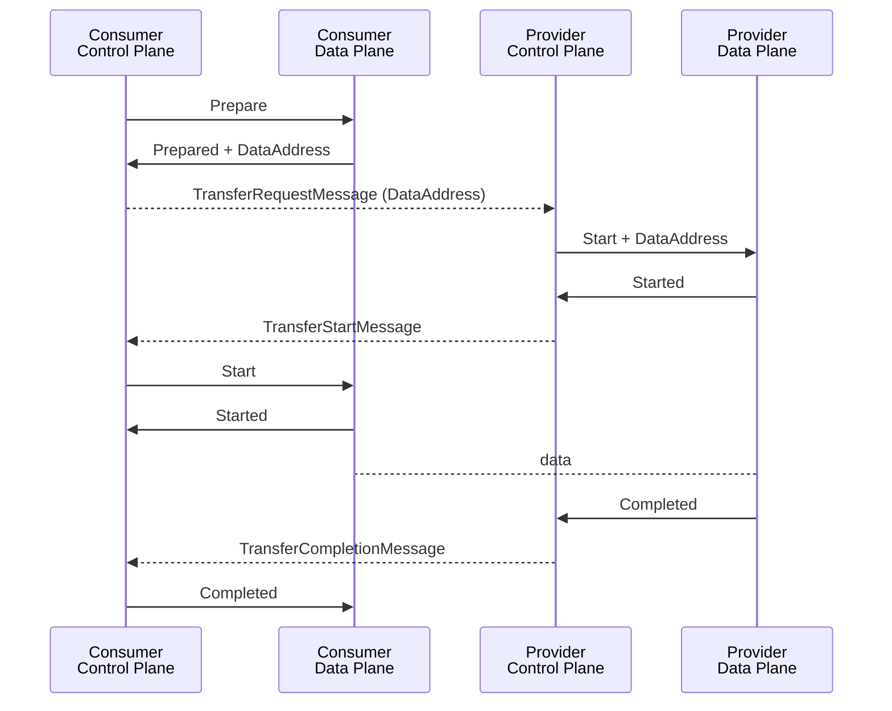
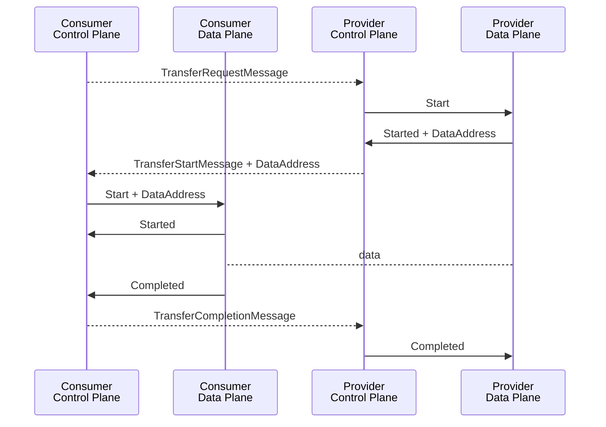

# Data Plane Signalling

## Data Transfer Types

Defined
in [DSP Specification](https://eclipse-dataspace-protocol-base.github.io/DataspaceProtocol/2025-1-RC4/#data-transfer-types).

| Push            | Pull              |
|-----------------|-------------------|
| Client Endpoint | Provider Endpoint |

### Back Channels

Subtype of Push and Pull types. Provider always supplies endpoint.

## Data Transfer State Machine

### Complete State Machine

Note: Any state can transition to `TERMINATED` (Note shown for simplicity)

### Optimized State Machine: Synchronous Operation

Note: Any state can transition to `TERMINATED` (Note shown for simplicity)

## Push

## Pull

