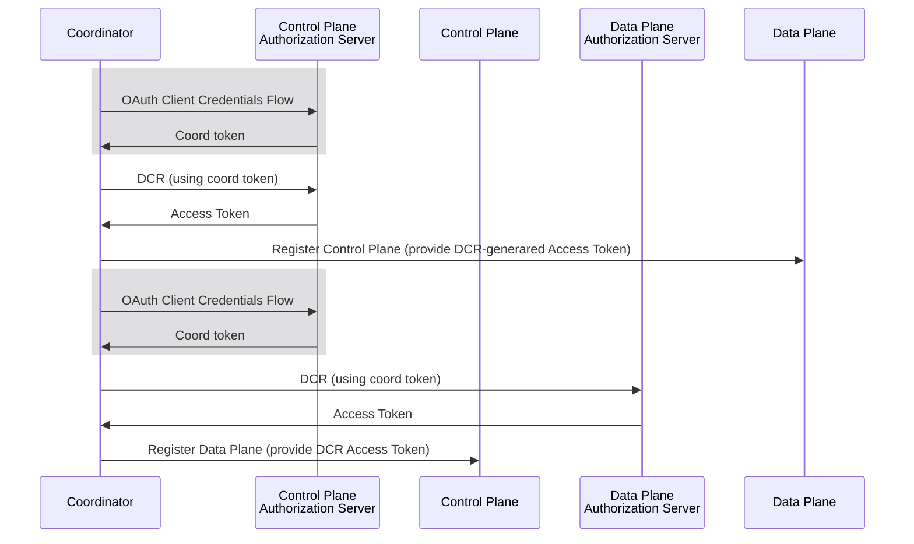

# Data Plane Signaling

Data Plane Signaling is an interoperable protocol and API used by connector control plane and data plane services to
execute a data transfer. The goal of Data Plane Signaling is to create an ecosystem of compatible control plane and data
plane implementations that can be matched to meet the requirements of dataspace use cases.

## Terminology

The following terms are used to describe concepts in this specification.

- Connector: Software services that manage the exchange of data between a
  provider and consumer as defined by the DSP Specification.
- Control Plane: The [=Connector=] services that implement the DSP protocol.
- Data Flow: The exchange of data belonging to a [=Dataset=] between a provider and consumer [=Data Plane=].
- Data Plane: The [=Connector=] services that implement a [=Data Flow=] using a [=Wire Protocol=].
- Dataset: Data or a technical service that can be shared as defined by the DSP Specification.
- Participant: A dataspace member as defined by the DSP Specification.
- Transfer Process: A set of interactions between two connectors that provide access to a dataset as defined by the DSP
  Specification.
- Wire Protocol: A protocol such as MQTT, AMQP, or an HTTP REST API that governs the exchange of data.

## Base Concepts

The DSP Specification models consumer access to a provider dataset in the [=Control Plane=] as
a [=Transfer Process=](https://eclipse-dataspace-protocol-base.github.io/DataspaceProtocol/2025-1-RC4/#dfn-transfer-process).
The [=Wire Protocol=] operations in the [=Data Plane=] that facilitate data exchange are modeled as a [=Data Flow=].
A [=Data Flow=] represents the current state of the physical data transfer.

### Data Transfer Types

A [=Data Flow=] is one of two data transfer types as defined in the
[DSP Specification](https://eclipse-dataspace-protocol-base.github.io/DataspaceProtocol/2025-1-RC4/#data-transfer-types):

| Push            | Pull              |
|-----------------|-------------------|
| Client Endpoint | Provider Endpoint |

Examples of push data transfers include an event stream published to a channel supplied by the consumer, or a
file sent to a consumer HTTP endpoint.

Examples of pull data transfers include an event stream that is published to a provider-supplied channel and accessed
via a consumer subscriber, or a provider HTTP REST API invoked by a consumer client.

#### Finite vs Non-Finite Data

DSP further distinguishes
[Finite and Non-Finite Data](https://eclipse-dataspace-protocol-base.github.io/DataspaceProtocol/2025-1-RC4/#finite-and-non-finite-data).
Finite data has a demarcated end, for example, a file or set of files. Non-Finite data has no specified end. It could be
an ongoing event stream or an HTTP REST API.

#### Back Channels

Some wire protocols may have the concept of a back channel. For example, a notification system implemented as an event
stream may have a reply queue for event consumers to provide response data. Back channels can exist for push or pull
transfer types. However, back channel endpoints are always supplied and managed by the provider.

## Data Flow State Machine

A [=Data Flow=] is defined as a state machine. [=Data Flow=] state transitions result in wire protocol operations.

### State Machine Definition

The [=Data Flow=] state machine is defined by the following states and transitions, which implementations MUST support:


Note: Any state can transition to `TERMINATED` (Note shown for simplicity)

[=Data Flow=] states are:

- **INITIALIZED**: The state machine has been initialized.
- **PREPARING**: A consumer or provider data plane are in the process of preparing to receive or send data using a wire
  protocol. This process may involve provisioning resources such as access tokens or preparing data.
- **PREPARED**: The consumer or provider is ready to receive or send data.
- **STARTING**: The consumer or provider is starting the wire protocol.
- **STARTED**: The consumer or provider has started sending data using the wire protocol.
- **SUSPENDED**: The data send operation is suspended.
- **COMPLETED**: The data send operation has completed normally. This is a terminal state.
- **TERMINATED**: The data send operation has terminated before completion. This is a terminal state.

Terminal states are final; the state machine MUST NOT transition to another state.

### Asynchronous Transitions

Under normal operation, a `prepare` request sent from the [=Control Plane=] to the [=Data Plane=] will result in the
state machine transitioning from its INITIALIZED state to PREPARED. Similarly, a start request will result in the state
machine transitioning from its INITIALIZED state to STARTED. These transitions MAY happen asynchronously to allow for
the efficient handling of long-running processes. All other transitions MUST be performed synchronously.

### Synchronous Operation

In many scenarios, a [=Data Plane=] MAY immediately transition from its INITIAL state to either the STARTED or PREPARED
state. In these cases, the transitions happen synchronously and can be represented in compact form as follows:


Note: Any state MAY transition to `TERMINATED` (Note shown for simplicity)

## Protocol Messaging

Data Plane Signaling messages are mapped to state machine transitions in the same way for push and pull data transfer
types. The difference lies in when [Data Addresses](#data-address) are transmitted.

### Data Address

A `DataAddress` conveys information to access a [=Wire Protocol=] endpoint. The `DataAddress` may contain an
authorization toke. Implementations MUST support `DataAddress` serialization as defined by the DSP specification. The
following is a non-normative example of a `DataAddress`:

```json

{
  "@type": "DataAddress",
  "endpointType": "https://w3id.org/idsa/v4.1/HTTP",
  "endpoint": "https://example.com",
  "endpointProperties": [
    {
      "@type": "EndpointProperty",
      "name": "authorization",
      "value": "TOKEN-123"
    },
    {
      "@type": "EndpointProperty",
      "name": "authType",
      "value": "bearer"
    }
  ]
}

```

### Push Protocol Messaging

A push transfer type uses a [=Wire rotocol=] that allows a provider to send data to a consumer-supplied endpoint. This
requires the consumer control plane to issue a `prepare` request to the [=Data Plane=]. When the [=Data Plane=]
transitions to PREPARED, it will respond to the control plane with the `DataAddress` the provider [=Data Plane=] will
use to push data to the consumer. The complete [=Data Flow=] sequence is detailed below:


Note the transition to the PREPARED and STARTED states may be completed synchronously and returned as part of the
response to the consumer request. Or, the transitions may be completed asynchronously, and the response delivered as a
callback.

### Pull Protocol Messaging

The pull transfer type uses a wire protocol that allows the consumer to initiate the transfer by sending a request to a
provider endpoint. The flow is similar to the push type, except the `DataAddress` is generated by the
provider [=Data Plane=] as part of the transition to the STARTED state. The consumer [=Data Plane=] receives the
`DataAddress` from its control plan via a start message and can initiate the wire protocol. This sequence is detailed in
the following diagram:


DSP messages are shown with a dotted line.

Note that the consumer `prepare` request (highlighted in gray) is optional for the pull transfer type, and MAY be
omitted as an optimization by the consumer control plane.

## Data Flow API

The [=Data Flow=] API comprises separate [=Data Plane=] and [=Control Plane=] endpoints.

### Base URL

All endpoint URLs in this specification are relative. The base URL MUST use the HTTPS scheme. The base URL is
implementation-specific and may include additional context information such as a sub-path that indicates a version.

### Data Plane Endpoint

The Data Plane Endpoint is used by the [=Control Plane=] to manage [=Data Flows=].

#### Prepare

The `prepare` request signals to the [=Data Plane=] to initialize a [=Data Flow=] and any resources required for data
transfer. The request results in a state machine transition to PREPARING or PREPARED. If the state machine transitions
to PREPARING, the [=Data Plane=] MUST return HTTP 202 Accepted with the `Location` header set to
the [data flow status relative URL](#status) and a message body containing a `DataFlowResponseMessage`. If the state
machine transitions to PREPARED, the [=Data Plane=] MUST return HTTP 200 OK and a `DataFlowResponseMessage`.

|                 |                                                                                                                                                                               |
|-----------------|-------------------------------------------------------------------------------------------------------------------------------------------------------------------------------|
| **HTTP Method** | `POST`                                                                                                                                                                        |
| **URL Path**    | `/dataflows/prepare`                                                                                                                                                          |
| **Request**     | [`DataFlowPrepareMessage`](#dataflowpreparemessage)                                                                                                                           |
| **Response**    | `HTTP 200` with a [`DataFlowResponseMessage`](#dataflowresponsemessage) OR `HTTP 202` with a [`DataFlowResponseMessage`](#dataflowresponsemessage) OR `HTTP 4xx Client Error` |

##### DataFlowPrepareMessage

##### DataFlowResponseMessage

#### Start

The `start` request signals to the [=Data Plane=] to begin a data transfer. The request results in a state machine
transition to STARTING or STARTED. If the state machine transitions to STARTING, the [=Data Plane=] MUST return HTTP 202
Accepted with the `Location` header set to the [data flow status relative URL](#status) and a message body containing a
`DataFlowResponseMessage`. If the state machine transitions to STARTED, the [=Data Plane=] MUST return HTTP 200 OK and a
`DataFlowResponseMessage`.

|                 |                                                                                                                                                                               |
|-----------------|-------------------------------------------------------------------------------------------------------------------------------------------------------------------------------|
| **HTTP Method** | `POST`                                                                                                                                                                        |
| **URL Path**    | `/dataflows/:id/start` OR `/dataflows/start`                                                                                                                                  |
| **Request**     | [`DataFlowStartMessage`](#dataflowstartmessage)                                                                                                                               |
| **Response**    | `HTTP 200` with a [`DataFlowResponseMessage`](#dataflowresponsemessage) OR `HTTP 202` with a [`DataFlowResponseMessage`](#dataflowresponsemessage) OR `HTTP 4xx Client Error` |

##### DataFlowStartMessage

##### DataFlowResponseMessage

#### Suspend

The `suspend` request signals to the [=Data Plane=] to suspend a data transfer.

|                 |                                                     |
|-----------------|-----------------------------------------------------|
| **HTTP Method** | `POST`                                              |
| **URL Path**    | `/dataflows/:id/suspend`                            |
| **Request**     | [`DataFlowSuspendMessage`](#dataflowsuspendmessage) |
| **Response**    | `HTTP 200` OR `HTTP 4xx Client Error`               |

##### DataFlowSuspendMessage

#### Terminate

The `terminate` request signals to the [=Data Plane=] to terminate a data transfer.

|                 |                                                         |
|-----------------|---------------------------------------------------------|
| **HTTP Method** | `POST`                                                  |
| **URL Path**    | `/dataflows/:id/terminate`                              |
| **Request**     | [`DataFlowTerminateMessage`](#dataflowterminatemessage) |
| **Response**    | `HTTP 200` OR `HTTP 4xx Client Error`                   |

##### DataFlowTerminateMessage

#### Status

The `status` request returns a representation of the [=Data Flow=].

|                 |                                                                                                                |
|-----------------|----------------------------------------------------------------------------------------------------------------|
| **HTTP Method** | `GET`                                                                                                          |
| **URL Path**    | `/dataflows/:id`                                                                                               |
| **Request**     | Empty body                                                                                                     |
| **Response**    | `HTTP 200` OR `HTTP 4xx Client Error` with a [`DataFlowStatusResponseMessage`](#dataflowstatusresponsemessage) |

##### DataFlowStatusResponseMessage

### Control Plane Endpoint

The Control Plane Endpoint is used by the [=Data Plane=] to make state transition callbacks.

#### Prepared

The `prepared` request signals to the [=Control Plane=] that the [=Data Flow=] is in the PREPARED state.

|                 |                                                       |
|-----------------|-------------------------------------------------------|
| **HTTP Method** | `POST`                                                |
| **URL Path**    | `/transfers/:transferId/dataflow/prepared`            |
| **Request**     | [`DataFlowResponseMessage`](#dataflowresponsemessage) |
| **Response**    | `HTTP 200` OR `HTTP 4xx Client Error`                 |

#### Started

The `started` request signals to the [=Control Plane=] that the [=Data Flow=] is in the STARTED state.

|                 |                                                       |
|-----------------|-------------------------------------------------------|
| **HTTP Method** | `POST`                                                |
| **URL Path**    | `/transfers/:transferId/dataflow/started`             |
| **Request**     | [`DataFlowResponseMessage`](#dataflowresponsemessage) |
| **Response**    | `HTTP 200` OR `HTTP 4xx Client Error`                 |

#### Completed

The `completed` request signals to the [=Control Plane=] that the [=Data Flow=] is in the COMPLETED state.

|                 |                                             |
|-----------------|---------------------------------------------|
| **HTTP Method** | `POST`                                      |
| **URL Path**    | `/transfers/:transferId/dataflow/completed` |
| **Request**     | [`DataFlowCompletedMessage`]                |
| **Response**    | `HTTP 200` OR `HTTP 4xx Client Error`       |

#### Errored

The `errored` request signals to the [=Control Plane=] that the [=Data Flow=] is in the TERMINATED state due to a
non-recoverable error at the [=Wire Protocol=] layer.

Note that only terminal, non-recoverable errors should be reported to the [=Control Plane=]. Transient errors should be
handled by the [=Data Plane=].

NOTE see [Terminated Event propagation](https://github.com/Metaform/dataplane-signaling/issues/1) for why a `terminated`
request does not exist.

|                 |                                           |
|-----------------|-------------------------------------------|
| **HTTP Method** | `POST`                                    |
| **URL Path**    | `/transfers/:transferId/dataflow/errored` |
| **Request**     | [`DataFlowErroredMessage`]                |
| **Response**    | `HTTP 200` OR `HTTP 4xx Client Error`     |

## Registration

Registration is the process where a [=Data Plane=] is registered with the [=Control Plane=] and vice versa. Registration
may be performed through configuration, via an endpoint, or both. This section describes the registration process for
both [=Data Plane=] and [=Control Plane=] deployments.

Registration may be performed multiple times to update information. Updates follow `replace` semantics. Authorization
key rotation can be achieved by updating registrations.

Since the Data Plane Signaling API is bidirectional, security should be enforced on both the [=Control Plane=]
and [=Data Plane=]. This can be achieved at the networking layer or by using a mutual authorization profile. The
registration process is designed to convey data required to bootstrap authorization.

Note that the registration process granularity is not defined by this specification and is implementation-specific. For
example, a registration may be per deployment or per participant in a multi-participant deployment.

### Data Plane Registration

Data Plane registration is the process where a [=Data Plane=] is registered with the [=Control Plane=].

#### The Data Plane Registration Type

The data plane registration object contains the following properties:

|              |                                                                                                     |
|--------------|-----------------------------------------------------------------------------------------------------|
| **Schema**   | [JSON Schema](./resources/TBD)                                                                      |
| **Required** | - `endpoint`: The data plane signaling endpoint.                                                    |
|              | - `transferTypes`: An array of one or more strings corresponding to supported transfer types.       |
| **Optional** | - `authorization`: an array of one or more authorization objects .                                  |
|              | - `labels`: an array of one or more strings corresponding to labels associated with the data plane. |

The following is a non-normative example of a Data Plane registration data object:

```json
{
  "dataplaneId": "7d6fda82-98b6-4738-a874-1f2c003a79ff",
  "name": "My Data Plane",
  "description": "My Data Plane Description",
  "endpoint": "https://example.com/signaling",
  "transferTypes": [
    "com.test.http-pull"
  ],
  "authorization": [
    {
      "type": "..."
    }
  ],
  "labels": [
    "label1",
    "label2"
  ]
}
```

##### Transfer Types

The transfer type scheme is defined as follows:

`[FORWARDTYPE]-[push|pull](-[RESPONSETYPE])`

where:

- `FORWARDTYPE` is the name of the data transfer type. the name should include a qualifier and protocol identifier in
  the form of `[qualifier].[protocol]`, for example, `com.test.http`. The forward type is case-insensitive and must be
  unique.
- `PUSH` or `PULL` indicates whether the data transfer type is push or pull. The type is case-insensitive.
- `RESPONSETYPE` is optional and indicates whether the data transfer type supports response messages. It is the same
  format as the `FORWARDTYPE`.

##### Authorization Object

The authorization object contains one mandatory property `type` identifying a supported Authorization Profile and MAY
contain additional properties specific to the profile.

#### Configuration-based Registration

A [=Control Plane=] implementation MAY support registration through configuration. In this scenario, the way
configuration is applied is implementation-specific.

#### Endpoint Registration

A [=Control Plane=] implementation MAY support registration through an endpoint. The endpoint is defined as follows:

|                 |                                       |
|-----------------|---------------------------------------|
| **HTTP Method** | `POST`                                |
| **URL Path**    | `/dataplanes/registration`            |
| **Request**     | [`DataPlaneRegistrationMessage`]      |
| **Response**    | `HTTP 200` OR `HTTP 4xx Client Error` |

The `DataPlaneRegistrationMessage` adheres to the [Registration type](#the-registration-type) structure. The endpoint
MAY require an authorization mechanism such as OAuth 2.0 or API Key. This is implementation-specific.

Note that the endpoint is relative and may include additional context information such as a sub-path that indicates a
participant ID the registration applies to.

TODO: Define DataPlaneRegistrationRegistrationMessage, including the `dataplaneId` property.

#### Endpoint Update

If the [=Control Plane=] implementation supports endpoint registration, it MUST support endpoint updates. The endpoint
update is defined as follows:

|                 |                                         |
|-----------------|-----------------------------------------|
| **HTTP Method** | `PUT`                                   |
| **URL Path**    | `/dataplanes/:dataplaneId/registration` |
| **Request**     | [`DataPlaneRegistrationMessage`]        |
| **Response**    | `HTTP 200` OR `HTTP 4xx Client Error`   |

Update semantics are defined as a `replace` operation.

##### Deletion

If the [=Control Plane=] implementation supports endpoint registration, it MUST support endpoint deletion defined as
follows:

|                 |                                         |
|-----------------|-----------------------------------------|
| **HTTP Method** | `DELETE`                                |
| **URL Path**    | `/dataplanes/:dataplaneId/registration` |
| **Response**    | `HTTP 204` OR `HTTP 4xx Client Error`   |

### Control Plane Registration

Control Plane registration is the process where a [=Control Plane=] is registered with the [=Data Plane=].

#### The Control Plane Registration Type

The control plane registration object contains the following properties:

|              |                                                                    |
|--------------|--------------------------------------------------------------------|
| **Schema**   | [JSON Schema](./resources/TBD)                                     |
| **Required** | - `endpoint`: The control plane signaling endpoint.                |
| **Optional** | - `authorization`: an array of one or more authorization objects . |

The following is a non-normative example of a Control Plane registration data object:

```json
{
  "dataplaneId": "bcf2d204-03bc-4354-8e92-b15b68d3c358",
  "name": "My Control Plane",
  "description": "My Control Plane Description",
  "endpoint": "https://example.com/signaling",
  "authorization": [
    {
      "type": "..."
    }
  ]
}
```

##### Authorization Object

The authorization object contains one mandatory property `type` identifying a supported Authorization Profile and MAY
contain additional properties specific to the profile.

#### Configuration-based Registration

A [=Data Plane=] implementation MAY support registration through configuration. In this scenario, the way
configuration is applied is implementation-specific.

#### Endpoint Registration

A [=Data Plane=] implementation MAY support registration through an endpoint. The endpoint is defined as follows:

|                 |                                       |
|-----------------|---------------------------------------|
| **HTTP Method** | `POST`                                |
| **URL Path**    | `/controlplanes/registration`         |
| **Request**     | [`ControlPlaneRegistrationMessage`]   |
| **Response**    | `HTTP 200` OR `HTTP 4xx Client Error` |

The `ControlPlaneRegistrationMessage` adheres to the [Registration type](#the-registration-type) structure. The endpoint
MAY require an authorization mechanism such as OAuth 2.0 or API Key. This is implementation-specific.

Note that the endpoint is relative and may include additional context information such as a sub-path that indicates a
participant ID the registration applies to.

TODO: Define DataPlaneRegistrationRegistrationMessage, including the `dataplaneId` property.

#### Endpoint Update

If the [=Data Plane=] implementation supports endpoint registration, it MUST support endpoint updates. The endpoint
update is defined as follows:

|                 |                                               |
|-----------------|-----------------------------------------------|
| **HTTP Method** | `PUT`                                         |
| **URL Path**    | `/controlplanes/:controlplaneId/registration` |
| **Request**     | [`ControlPlaneRegistrationMessage`]           |
| **Response**    | `HTTP 200` OR `HTTP 4xx Client Error`         |

Update semantics are defined as a `replace` operation.

##### Deletion

If the [=Data Plane=] implementation supports endpoint registration, it MUST support endpoint deletion defined as
follows:

|                 |                                               |
|-----------------|-----------------------------------------------|
| **HTTP Method** | `DELETE`                                      |
| **URL Path**    | `/controlplanes/:controlplaneId/registration` |
| **Response**    | `HTTP 204` OR `HTTP 4xx Client Error`         |

### Authorization Profiles

This section describes two optional profiles that can be used to authorize a [=Data Plane=] or [=Control Plane=]
registration.

#### OAuth 2 Client Credentials Grant

A [=Control Plane=] or [=Data Plane=] that supports the OAuth 2.0 Client Credentials Grant as is defined
in [RFC 6749](https://tools.ietf.org/html/rfc6749#section-4.4) includes an `oauth2_client_credentials` authorization
profile entry in its `authorization` array. This entry contains the following properties:

|              |                                                                                                                                                 |
|--------------|-------------------------------------------------------------------------------------------------------------------------------------------------|
| **Schema**   | [JSON Schema](./resources/TBD)                                                                                                                  |
| **Required** | - `type`: Must be `oauth2_client_credentials`.                                                                                                  |
|              | - `tokenEndpoint`: The URL of the authorization server's token endpoint as defined in [RFC6749](https://datatracker.ietf.org/doc/html/rfc6749). |
|              | - `clientId`: The OAuth2 client id used for the Client Credentials Grant.                                                                       |
|              | - `clientSecret`: The OAuth2 client secret used for the Client Credentials Grant.                                                               |

The following is a non-normative example of an OAuth2 entry:

```json
{
  "authorization": [
    {
      "type": "oauth2_client_credentials",
      "tokenEndpoint": "https://example.com/auth",
      "clientId": "1234567890",
      "clientSecret": "1234567890"
    }
  ]
}
```

##### Dynamic Client Registration

TODO Discussion of the control/data plane being a resource server and dynamic client registration.



#### API Key

```json
{
  "authorization": [
    {
      "type": "apikey",
      "key": "....."
    }
  ]
}
```

## Data Transfer Type Registry

Define how data transfer types can be registered with the data Plane Signaling project. One requirement is that they
need to publish a Wire Protocol Signaling Specification. Define what the specification must contain.

### Wire Protocol Signaling Specification Requirements

## Open Issues

https://github.com/Metaform/dataplane-signaling/issues
